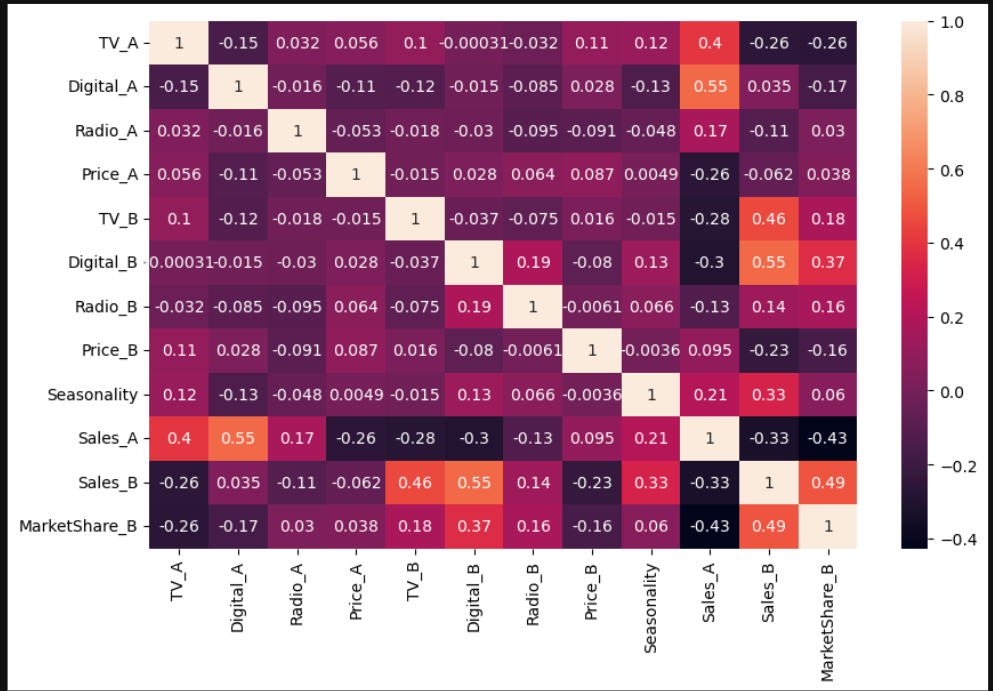

# Market Mix Modelling (MMM) Project

## Overview
This project demonstrates a simplified implementation of **Market Mix Modelling (MMM)** using Python. The objective is to analyze how different marketing channels influence sales to estimate the contribution of each channel to overall business Performance .

Market Mix Modelling is widely used by companies to measure the effectiveness of marketing investments and optimize marketing budget allocation.

#

## Problem Statement
Companies invest heavily in multiple marketing channels such as TV, digital media and radio advertising. However, it is often difficult to determine which channels contribute most to sales.

The goal of this project is to : 

* Understand the relationship between marketing spends and sales.
* Quantify the contribution of each marketing channel.
* Estimate marketing ROI
* Provide insights for marketing budget optimization

#

## DATASET

A *synthetic dataset* was generated to simulate real-world marketing data.

The dataset includes weekly observations of :

* TV advertising spread
* Digital advertising spend
* Radio advertising spend
* Competitor advertising activity
* Product price
* Seasonality
* Sales

Synthetic data was used because real marketing datasets are usually confidential.

## Methodology 
**1. Exploratory Data Analysis (EDA)**

EDA was performed to understand patterns and relationships in the dataset.

Technique used :
* Correlation Heatmap

  

#

**2.Adstock Transformation**

Advertising effects do not occur only in the current period. Instead, they persist over time and gradually decay.

To capture this carryover effect, **Adstock transformation** was applied to marketing channels.

#

**3.Regression Modeling**

An **Ordinary Least Square(OLS) regression** model was built to estimate the impact of marketing activities on sales.

* TV advertising(adstock)
* Digital advertising(adstock)
* Radio advertising(adstock)
* Competitor advertising
* Price
* Seasonality

Target variables :
*Sales

